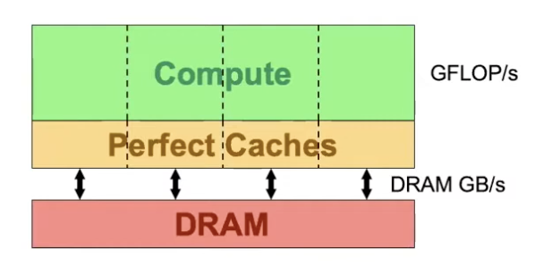

# Optimization of GEMM & Conv

### Introduction
- Overall Performance(GFLOPS)

| CONV               | 3\*3\*224\*224\*64\*64 | 3\*3\*14\*14\*512\*512 |
| ------------------ | ---------------------- | ---------------------- |
| SEQ                | 1.48                   | 1.48                   |
| NAIVE              | 1563                   | 1220                   |
| COALESCING         | 1681                   | 1050                    |
| BLOCK TILING       | 2014                   | 1266                   |
| SHARED             | 5249                   | 2935                   |
| VECTORIZE & UNROLL | 8914                   | 4425                   |
|                    |                        |                        |

- Machince Architecture
```python
MemoryBandwidth = 651 * (1024 ** 3) # 651 GB/s
MaxFLOPS = 13.8 * 1000              # 13.8 TFLOPS
MaxThreadPerSM = 2048
MaxThreadPerBlock = 1024
WarpSize = 32
L2CacheSize = 4718592 #Bytes
alpha = 1000**(-3)
DataTypeBytes = 4 # we use float
# B, Kx, Ky, Nx, Ny, Ni, Nn = 16, 3, 3, 224, 224, 64, 64
# B, Kx, Ky, Nx, Ny, Ni, Nn = 16, 3, 3, 14, 14, 512, 512
```

## [Naive Kernel](./src/kernels/conv_01_naive.cuh)
For the naive model, let's assume this is the . In addition, assume every thing in an block is perfectly cached by L1 cache. These assumption means that we need to add a magic number beta to make our analysis accurate.
- if L1 cache is large enough. Each block need to load from input B\*Ni\*NxPAD\*NyPAD times, load from weight Ni\*Kx\*Ky times, store to output B\*NxSCL\*NySCL. Each block need to do 2\*B\*NxSCL\*NySCL\*Ni\*Kx\*Ky times float op.
- according to our result, we should set beta to 1/8. This constant means everything that we ignore for now, like memory uncoalesce, cache miss and shared memory.
- This model is simple but predicts surprisingly good with different batchsize for naive kernel.
- To erase the magic number beta=1/8, we analyze the behavior of the naive_kernel and decide to change the format of input and output. The code is [here](./src/kernels/conv_02_coalescing.cuh). We use the similar way to model this kernel. The good news is that now we can set beta=1. That bad news is that the estimation error is larger.

```python
betaNaive = 1/8
# for conv1, predict: 1521, actual: 1563
# for conv2, predict: 1120, actual: 1220
def naiveModel(B, Kx, Ky, Nx, Ny, Ni, Nn, beta):
  NxSCL, NySCL, NxPAD, NyPAD = Nx, Ny, Nx+Kx-1, Ny+Ky-1
  ConvOperationIntensity = 2*B*NxSCL*NySCL*Ni*Kx*Ky/(B*Ni*NxPAD*NyPAD + Ni*Kx*Ky + B*NxSCL*NySCL)/4
  gflops = min(MaxFLOPS, ConvOperationIntensity*MemoryBandwidth*alpha*beta) 
  return gflops

# for conv1, predict: 1374, actual: 1681
# for conv2, predict: 1394, actual: 1050
def coalescModel(B, Kx, Ky, Nx, Ny, Ni, Nn, BZ, beta=1):
  NxSCL, NySCL, NxPAD, NyPAD = Nx, Ny, Nx+Kx-1, Ny+Ky-1
  ConvOperationIntensity = 2*BZ*Ni*Kx*Ky/(Ni*Kx*Ky + BZ*Ni*Kx*Ky + BZ)/4
  gflops = min(MaxFLOPS, ConvOperationIntensity*MemoryBandwidth*alpha*beta) 
  return gflops
```

## [Block Tiling Kernel](./src/kernels/conv_03_block_tiling.cuh)
The main problem with the coalescing\_kernel is that the operation intensity is too low! Therefore, we introduce tiling to increase the performance.
In addition, let's introduce more constraints:
- some of the SP might be idle. Therefore, the computation limitation should take this into count.
- There is L1 cache miss. The Size of L1 Cache is 128KB. [!img](./pics/V100Arch.png)
- Each thread need to load from input Ni\*TXPAD\*TYPAD times, load from weight Ni\*Kx\*Ky times, store to output TX\*TY. Each block need to do 2\*Ni\*TX\*TY\*Kx\*Ky times float op.


```python
NumMP = 80
L1Size = 128 * 1024
# for conv1, predict: 13800, actual: 2014
# for conv2, predict: 13800, actual: 1266
def blocktilingModel(B, Kx, Ky, Nx, Ny, Ni, Nn, BZ=64, TX=14, TY=14):
  TXPAD, TYPAD = TX+Kx-1, TY+Ky-1
  numBLOCKS = Nn/BZ * B * Nx * Ny / TX / TY
  MPRatio = min(numBLOCKS / NumMP, 1.0)
  numBytesWeight = (Ni*Kx*Ky*BZ)*4
  numBytesOutput = (BZ*TX*TY)*4
  numBytesInput = (Ni*TXPAD*TYPAD)*4

  ConvOperationIntensity = 2*BZ*Ni*Kx*Ky*TX*TY/(numBytesWeight + numBytesOutput + numBytesInput*(numBytesInput/L1Size + 1)) 
  gflops = min(MaxFLOPS*MPRatio, ConvOperationIntensity*MemoryBandwidth*alpha) 
  return gflops
```


## [Shared Model](./src/kernels/conv_05_vectorize.cuh)
- Each Block first load to L2 Cache. Then load from L2 cache.
```python
L2Size = 6144 * 1024 # 6144 KB
MemoryBandwidth = 2155 * (1024 ** 3) # 651 GB/s
```


## Appendix
1. useful commands 
```bash
cd ~/cuda-samples && ./Samples/1_Utilities/deviceQuery/deviceQuery
# generate performance report
ncu --set full ./conv1 > ncu_conv1_report.prof
# analyze stall reasons
ncu --metrics "regex:.*smsp__pcsamp_warps_issue.*" ./conv1
# see bank conflict
nvprof -e shared_ld_bank_conflict,shared_st_bank_conflict --metrics shared_efficiency,shared_load_transactions_per_request ./conv1
```

2. result running using `cd ~/cuda-samples && ./Samples/1_Utilities/deviceQuery/deviceQuery`, more info can be found [here](https://arxiv.org/pdf/1804.06826.pdf):
```txt
Device 0: "NVIDIA TITAN V"
  CUDA Driver Version / Runtime Version          11.7 / 11.7
  CUDA Capability Major/Minor version number:    7.0
  Total amount of global memory:                 12067 MBytes (12653035520 bytes)
  (080) Multiprocessors, (064) CUDA Cores/MP:    5120 CUDA Cores
  GPU Max Clock rate:                            1455 MHz (1.46 GHz)
  Memory Clock rate:                             850 Mhz
  Memory Bus Width:                              3072-bit
  L2 Cache Size:                                 4718592 bytes
  Maximum Texture Dimension Size (x,y,z)         1D=(131072), 2D=(131072, 65536), 3D=(16384, 16384, 16384)
  Maximum Layered 1D Texture Size, (num) layers  1D=(32768), 2048 layers
  Maximum Layered 2D Texture Size, (num) layers  2D=(32768, 32768), 2048 layers
  Total amount of constant memory:               65536 bytes
  Total amount of shared memory per block:       49152 bytes
  Total shared memory per multiprocessor:        98304 bytes
  Total number of registers available per block: 65536
  Warp size:                                     32
  Maximum number of threads per multiprocessor:  2048
  Maximum number of threads per block:           1024
  Max dimension size of a thread block (x,y,z): (1024, 1024, 64)
  Max dimension size of a grid size    (x,y,z): (2147483647, 65535, 65535)
  Maximum memory pitch:                          2147483647 bytes
  Texture alignment:                             512 bytes
  Concurrent copy and kernel execution:          Yes with 7 copy engine(s)
  Run time limit on kernels:                     No
  Integrated GPU sharing Host Memory:            No
  Support host page-locked memory mapping:       Yes
  Alignment requirement for Surfaces:            Yes
  Device has ECC support:                        Disabled
  Device supports Unified Addressing (UVA):      Yes
  Device supports Managed Memory:                Yes
  Device supports Compute Preemption:            Yes
  Supports Cooperative Kernel Launch:            Yes
  Supports MultiDevice Co-op Kernel Launch:      Yes
  Device PCI Domain ID / Bus ID / location ID:   0 / 175 / 0
```